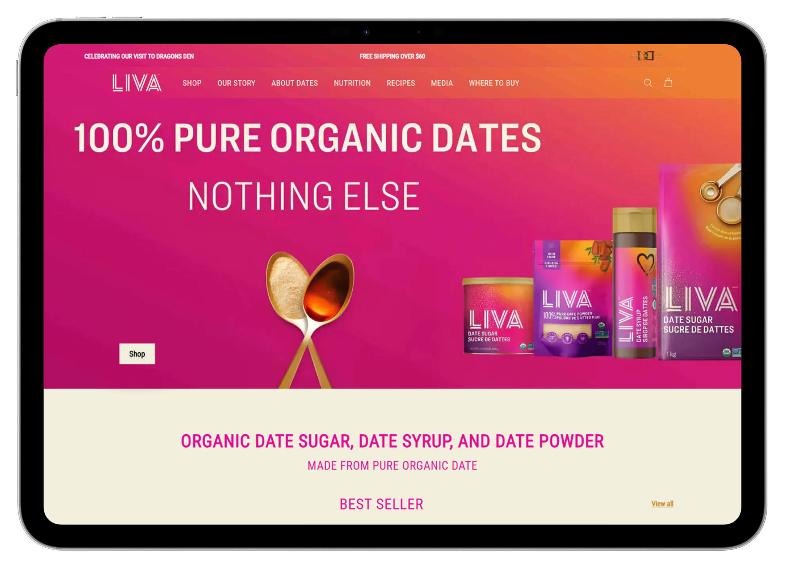
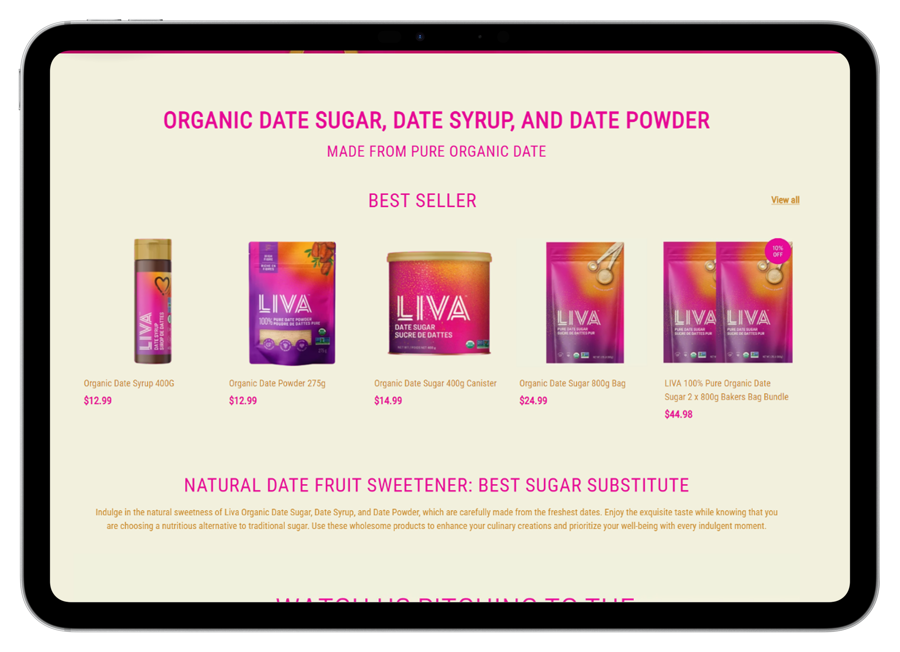
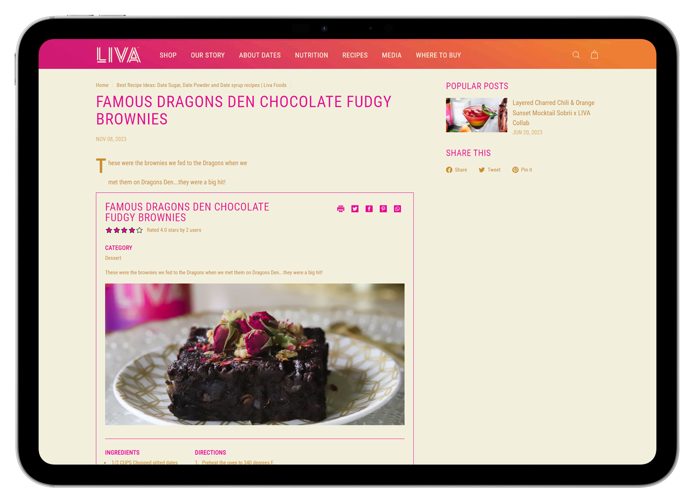
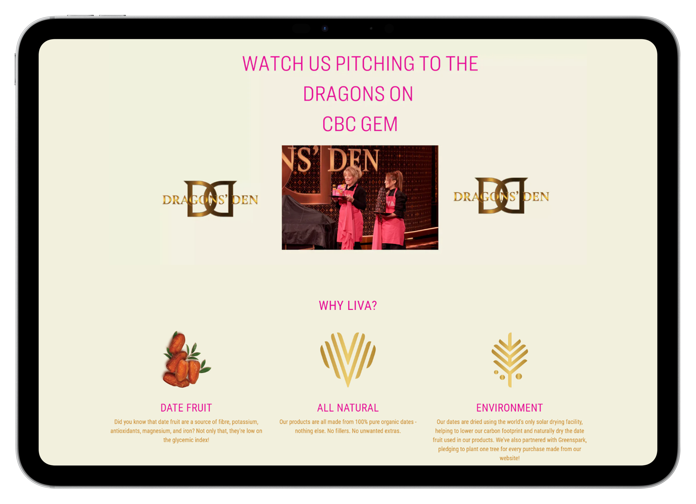
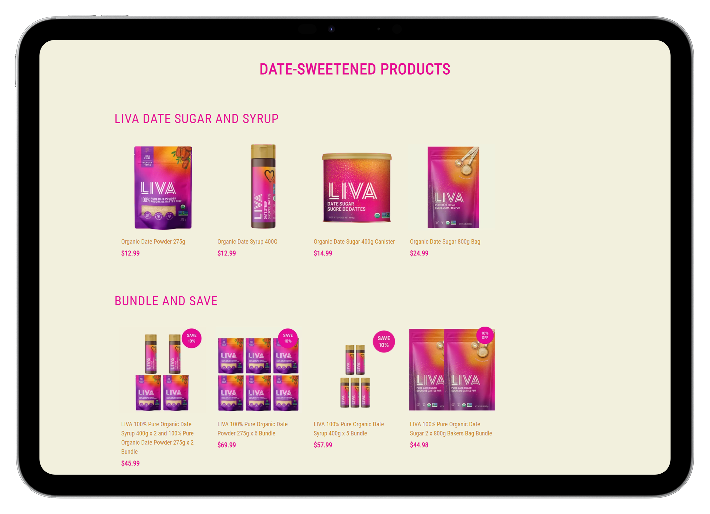

# Liva-Foods
LIVA, a leading provider of sugar alternatives specializing in organic date sugar, date syrup, and date powder, approached our digital marketing agency with a pressing concern. Despite offering premium products, their online visibility was hindered by poor on-page SEO performance. With a website plagued by 775 SEO issues and an on-page SEO score languishing at 57, LIVA sought our expertise to enhance their online presence and drive organic traffic.

### Main Screenshots

## Live Site
